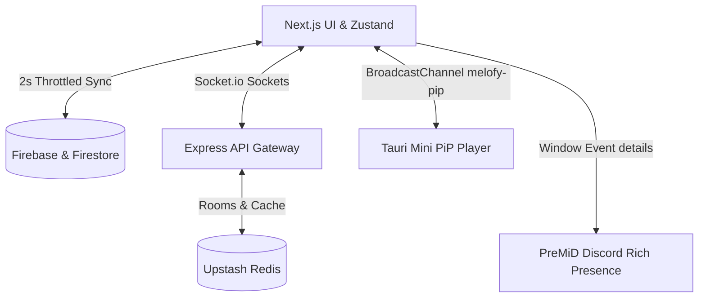

# Contributing to Melofy 🎵

First off, thank you for taking the time to contribute! Contributions are what make the open-source community such an amazing place to learn, inspire, and create. 

Melofy is built to be a premium, high-performance music streaming application with a stunning, fluid glassmorphic aesthetic across Web, Tauri v2 Desktop, and Capacitor Mobile platforms. By contributing, you agree to uphold these high standards of quality, security, and design.

---

## 🌟 Code of Conduct

We are committed to providing a welcoming, safe, and inclusive environment for everyone. Please be respectful, constructive, and empathetic in all interactions (issues, PRs, comments, and Discord).

---

## 💻 Development Setup

Melofy is managed as a high-performance **Turborepo monorepo**.

### Setup Steps
1. **Fork and Clone**:
   ```bash
   git clone https://github.com/YOUR-USERNAME/melofy.git
   cd melofy
   ```
2. **Install Dependencies**:
   ```bash
   npm install
   ```
3. **Configure Environment Variables**:
   Configure `.env` files in `apps/web/` and `apps/api/` (refer to `.env.example` templates in each folder).
4. **Ignite the Dev Servers**:
   ```bash
   npm run dev
   ```
   This command starts the Next.js Web app, the Express.js API gateway, and the monorepo pipeline concurrently.

---

## 📂 Monorepo Organization

- **`apps/web`**: Next.js 16 Web application containing the primary client-side user interface, Zustand stores, and state logic.
- **`apps/api`**: Express.js gateway server handling WebSocket communication, user synchronization, and metadata caching.
- **`apps/desktop`**: Tauri v2 workspace and native configurations (transparent, frameless window rules, local window control actions, and capabilities).
- **`apps/mobile`**: Capacitor client integration for wrapping the interface natively on iOS/Android.
- **`NodeLink`**: Pure NodeLink lossless audio player core streaming server.

---

## 🛠️ Advanced Architectural Stack

Understanding Melofy's internal synchronization and styling layers is essential for making cohesive, high-quality contributions.



### 1. Real-Time Jam Parties (Socket.io + Redis)
- Located in `apps/api/src/sockets/jam.ts`.
- Implements synchronized listening parties. Hosts create rooms identified by unique 6-character hex codes (e.g. `partyId = crypto.randomBytes(3).toString('hex').toUpperCase();`).
- Room sessions are stored in **Upstash Redis** with a 4-hour expiration (`{ ex: 14400 }`).
- Sockets broadcast active state structures (`currentTrack`, `currentTime`, `isPlaying`, etc.) dynamically. Hosts can selectively enable listener interactions by toggling `listenersCanControl`.

### 2. Player State Hydration & Throttled Sync
- Handled in `apps/web/src/hooks/usePlayerSync.ts`.
- **Hydration**: On mount, player configuration is populated dynamically from `/api/player-state`.
- **Throttling**: Changes to volume, history, track selections, or loop/shuffle states are queued and synced back to the backend database every **2 seconds** using a throttled `setTimeout` mechanism. This minimizes Firestore/network writes while keeping state persistent across page reloads.

### 3. External Integrations Coordinator
- Handled in `apps/web/src/components/ExternalIntegrations.tsx`.
- Rather than running heavy local listeners, the player exposes current metadata structures directly to `window.melofy`.
- Dispatches a custom `melofy_state_update` browser event on track or playback adjustments so the PreMiD integration can seamlessly reflect user activity on Discord.

### 4. Custom Theme Essences (CSS Custom Variables)
- Managed in `apps/web/src/app/globals.css`.
- Dynamic color profiles are mapped via HTML element custom attributes: `[data-essence='emerald']`, `[data-essence='golden']`, `[data-essence='cyan']`, `[data-essence='monochrome']`, `[data-essence='lavender']`, and `[data-essence='rose']`.
- Custom elements should strictly reference CSS utility variables (`var(--primary)`, `var(--background)`) rather than using hardcoded values, supporting instant runtime look changes.

### 5. Multi-Client Scrollbar Responsiveness
- Standard web desktop viewports (`min-width: 768px`) feature lightweight, custom hover-visible scrollbars that prevent layout shifting.
- Mobile layouts (`max-width: 767px`) completely suppress scrollbars (`scrollbar-width: none` and `::-webkit-scrollbar { display: none }`) to ensure a perfectly clean, native application feel.

---

## 🎨 Design & Security Guidelines

### 1. Vibrant Glassmorphism Aesthetics
- Translucent layouts should leverage a standard background styling system featuring heavy backdrops:
  ```css
  background: rgba(23, 23, 27, 0.85);
  backdrop-filter: blur(16px);
  border: 1px solid rgba(255, 255, 255, 0.08);
  ```
- This frosted-glass aesthetic must remain consistent across overlays, lists, players, and our custom right-click context menus.

### 2. Cross-Client Layout Limits
- Ensure any added features scale gracefully. The **Picture-in-Picture (PiP)** window renders a compact horizontal layout (`450x150`) on Tauri desktop, but respects the standard browser-imposed width safety limits (`380x240`) on traditional web browsers.

### 3. Inspect-Proofing & Custom Menus
- Standard browser right-click menus are replaced globally inside `AppWrapper.tsx` with a custom frosted glassmorphic menu providing quick, intuitive navigations:
  - **Back** (utilizing `router.back()`)
  - **Refresh** (via `window.location.reload()`)
  - **Search**, **Library**, and **Settings** redirects.
- Standard developer-focused shortcut keys (`F12`, `Ctrl+Shift+I/J/C`, `Ctrl+U`) are blocked globally.

### 4. Advanced Dev Abort Tolerances
- Asynchronous mounting actions should avoid throwing uncaught `AbortError` instances when fetches are cancelled during page transitions.
- Wrap fetch triggers in our custom `safeFetch` handler so aborted network operations safely resolve to clean non-ok response statuses (`499 Client Aborted`), fully eliminating Next.js Dev Server Fast Refresh runtime error screens.

---

## 📋 Pull Request Checklist

Before submitting your PR, please double-check:
- [ ] Code follows TypeScript best practices and compile rules.
- [ ] No unhandled Promise rejections are triggered.
- [ ] Styling matches the premium glassmorphism theme and works on all device targets.
- [ ] The monorepo builds successfully: `npm run build`.
- [ ] You have provided a clear description of the problem solved and the implementation details in your PR.

---

Thank you again for helping us make Melofy the ultimate music experience! 🎧✨
