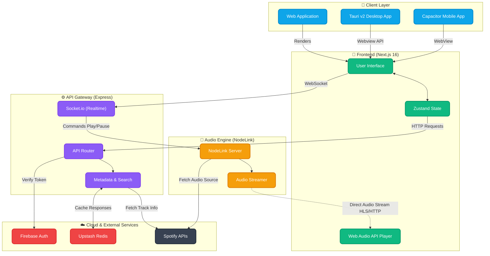

<div align="center">
  <br />
  
  <br />
  <h1>🎵 MELOFY</h1>
  <p><strong>Elevate Your Auditory Experience</strong></p>
  <p><i>A Premium, High-Performance Music Streaming Platform with a Modern Aesthetic.</i></p>

  <br />

  <div align="center">
    <a href="https://nextjs.org/"></a>
    <a href="https://tauri.app/"></a>
    <a href="https://capacitorjs.com/"></a>
    <a href="https://expressjs.com/"></a>
    <a href="https://firebase.google.com/"></a>
    <a href="https://tailwindcss.com/"></a>
    <a href="https://nodelink.js.org/"></a>
    <a href="https://discord.com/invite/ZVCB8EnRX2"></a>
  </div>

  <br />
  <br />
</div>

---

## 📽️ The Melofy Vision

**Melofy** isn't just a music web application; it's a meticulously crafted digital ecosystem for your music. Powered by a high-speed Turborepo monorepo, it bridges the gap between premium client interfaces (Web, Frameless Desktop, and Native Mobile) and a robust audio streaming backend.

<div align="center">
  <table border="0" cellspacing="0" cellpadding="20">
    <tr>
      <td width="300" valign="top" style="border: 1px solid #333; border-radius: 15px; background: rgba(255,255,255,0.05);">
        <h3>🎧 Pure Sound</h3>
        <p>Lossless streaming experience powered by <b>NodeLink</b>. Zero latency, maximum vibes.</p>
      </td>
      <td width="300" valign="top" style="border: 1px solid #333; border-radius: 15px; background: rgba(255,255,255,0.05);">
        <h3>🎨 Stunning UI</h3>
        <p>A fluid, glassmorphic interface built with <b>Framer Motion</b> and <b>Tailwind 4.0</b>.</p>
      </td>
    </tr>
    <tr>
      <td width="300" valign="top" style="border: 1px solid #333; border-radius: 15px; background: rgba(255,255,255,0.05);">
        <h3>🖥️ Frameless Desktop</h3>
        <p>Ultra-secure, inspect-proof, frameless desktop client powered by <b>Tauri v2</b>.</p>
      </td>
      <td width="300" valign="top" style="border: 1px solid #333; border-radius: 15px; background: rgba(255,255,255,0.05);">
        <h3>📱 Smart Mobile</h3>
        <p>Native feeling client with hardware optimization powered by <b>Capacitor</b>.</p>
      </td>
    </tr>
  </table>
</div>

---

## 🏗️ System Architecture

Melofy employs a distributed service architecture separating client layers, the main API gateway, and the dedicated audio streaming engine.



---

## 🛠️ Performance-Driven Tech Stack

<div align="center">
  <table>
    <tr>
      <th align="center">Layer</th>
      <th align="center">Technologies</th>
    </tr>
    <tr>
      <td><b>Frontend</b></td>
      <td><code>Next.js 16</code> • <code>React 19</code> • <code>TypeScript</code> • <code>Zustand</code> • <code>Radix UI</code> • <code>Lucide</code></td>
    </tr>
    <tr>
      <td><b>Clients</b></td>
      <td><code>Tauri v2</code> (Desktop) • <code>Capacitor 6</code> (Mobile)</td>
    </tr>
    <tr>
      <td><b>Styling</b></td>
      <td><code>Tailwind CSS 4.0</code> • <code>Framer Motion</code> • <code>Shadcn/UI</code></td>
    </tr>
    <tr>
      <td><b>Backend</b></td>
      <td><code>Node.js</code> • <code>Express</code> • <code>Socket.io</code> • <code>NodeLink</code></td>
    </tr>
    <tr>
      <td><b>Cloud</b></td>
      <td><code>Firebase Authentication</code> • <code>Upstash Redis</code></td>
    </tr>
  </table>
</div>

---

## 📂 Project Structure

```bash
melofy/
├── apps/
│   ├── web/        # Next.js 16 Frontend Web Client
│   ├── api/        # Express.js Backend (Audio Controller)
│   ├── desktop/    # Tauri v2 Desktop App Config
│   └── mobile/     # Capacitor Mobile App (Android/iOS wrapper)
├── NodeLink/       # NodeLink Audio Server
├── turbo.json      # Monorepo Orchestration
└── package.json    # Project Manifest
```

---

## 🏁 Quick Ignition

### 1️⃣ Clone & Fuel Up

```bash
git clone https://github.com/lazyshrey/melofy.git
cd melofy
npm install
```

### 2️⃣ Configure Environmentals

Copy the example files and fill in your credentials:

```bash
cp apps/web/.env.example apps/web/.env.local
cp apps/api/.env.example apps/api/.env
```

Important production variables:
- `apps/api`: `FIREBASE_API_KEY`, `CORS_ORIGINS`, NodeLink + Spotify + Upstash variables
- `apps/web`: Firebase public variables, Upstash variables, and `BACKEND_API_URL`

### 3️⃣ Launch the Engines

```bash
# Full Monorepo Dev (Recommended)
npm run dev
```

> **Pro Tip:** If you want to run the NodeLink audio server separately, navigate to `NodeLink/` and run `npm start`.

---

## 🤝 Community & Support

Join our Discord server to get updates, report bugs, or just hang out with the devs!

<div align="center">
  <a href="https://discord.gg/ZVCB8EnRX2">
    
  </a>
</div>

<br />

### Support the Project 💖

If you appreciate the work and want to support the development of Melofy, consider buying me a coffee!

<div align="center">
  <a href="https://payments.cashfree.com/forms/shrey">
    
  </a>
</div>

---

<div align="center">
  <p>Built with 💖 and ☕ by <b><a href="https://github.com/lazyshrey">lazyshrey</a></b></p>
  <p><i>© 2026 Melofy. Licensed under ISC.</i></p>
</div>
