# 🎨 Melofy Visual Showcase

Welcome to the Melofy Visual Showcase! This page presents the sleek, glassmorphic UI, rich interactive components, and native clients of **Melofy** across both desktop and mobile form factors.

---

## 📐 Unified Display & Capture Standard

To maintain a professional, cohesive, and pixel-perfect aesthetic across the repository, we use a **Unified Resolution Standard** for all media assets. If you are taking new screenshots or capturing new GIFs, please follow these specifications:

| Asset Type | Target Aspect Ratio | Recommended Capture Resolution | Suggested Display Width | Best Practices & Formats |
| :--- | :---: | :---: | :---: | :--- |
| **Desktop Screens** | `16:9` or `16:10` | **`1920 x 1080`** (or `1440 x 900`) | `900px` | Use Dark Mode by default. Clean window shadows; hide mouse cursor unless showing hover state. |
| **Mobile Screens** | `19.5:9` | **`1080 x 2400`** (or `1170 x 2532`) | `280px` | Crop status bars or keep them clean (no pending notifications). Use PNG format. |
| **Interactive GIFs** | `16:9` (Desktop) | **`1280 x 720`** (720p Optimized) | `900px` | Frame rate at **24–30 FPS**. Compress to keep files under **10MB** for smooth web loading. |
| **Compact Widgets** | Variable | *Direct Widget Crop* | `450px` | Picture-in-Picture, popovers, or Discord cards. Crop closely with zero background padding. |

---

## 🖥️ Desktop Interface

Experience the fluid glassmorphism design system built with Next.js 16, Tailwind 4.0, and Framer Motion.

### 🏠 Home & Dashboard Experience
A gorgeous, modern home dashboard showing personalized recommendations, quick shortcuts, and top mixes.

#### 🎥 Interaction Showcase (GIF)

  
  
<i>Real-time dashboard traversal, rich hover micro-animations, and dynamic page transiting.</i>

#### 🖼️ Home Dashboard (Dark Mode)

  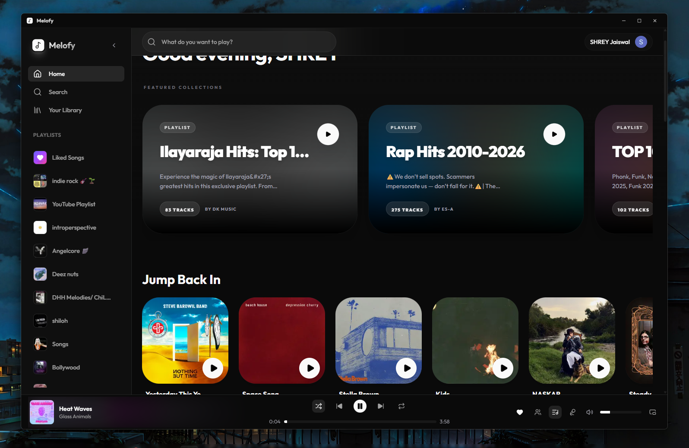
  
<i>The default premium glassmorphic Dark Mode interface.</i>

#### 🖼️ Home Dashboard (Light Mode)

  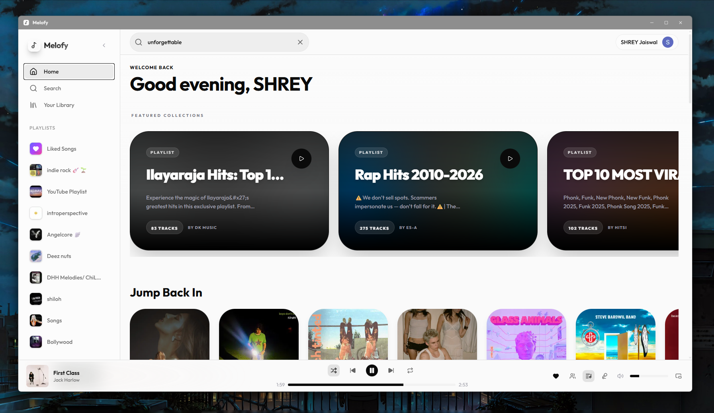
  
<i>Seamless, high-contrast Light Theme for clean daytime listening.</i>

---

### 🎵 Playback & Immersive Player
Control your music with pixel-perfect, interactive audio controllers.

#### 💿 Standard Now Playing View

  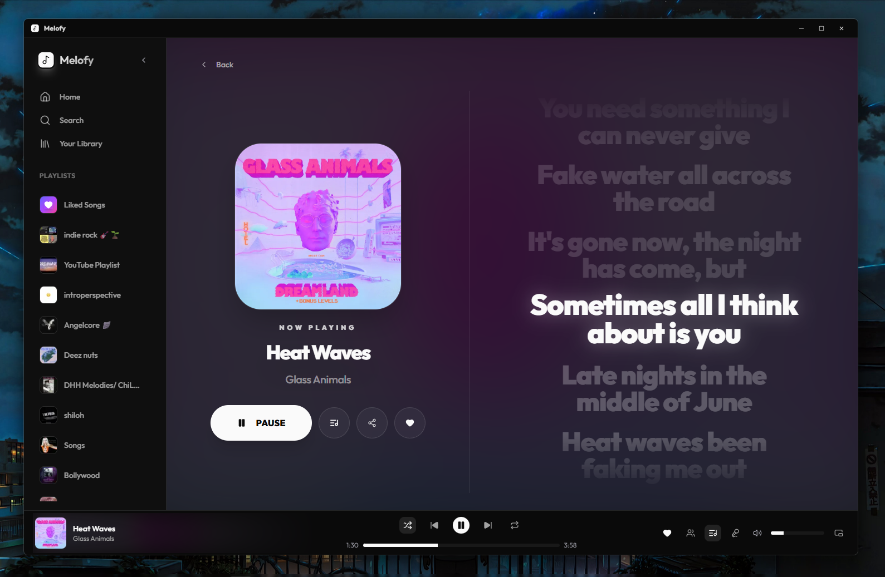
  
<i>Comprehensive playback interface with queue lists, smart recommendations, and track controls.</i>

#### 🎬 Fullscreen Immersive Player

  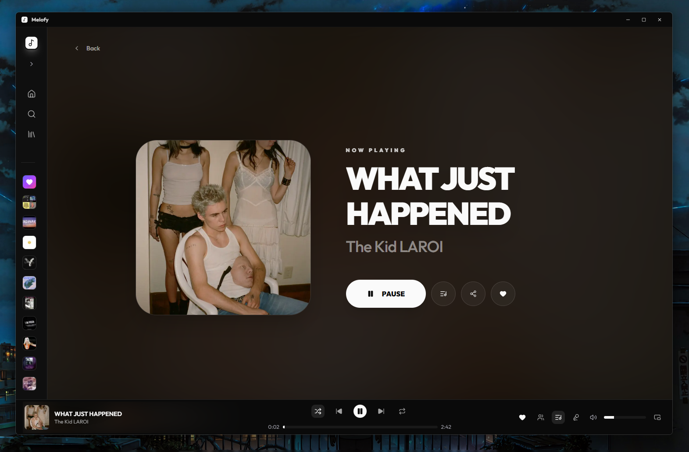
  
<i>Zero-distraction fullscreen view featuring dynamic backdrop-filter blur matching the current album art.</i>

#### 🎤 Synchronized Lyrics Overlay

  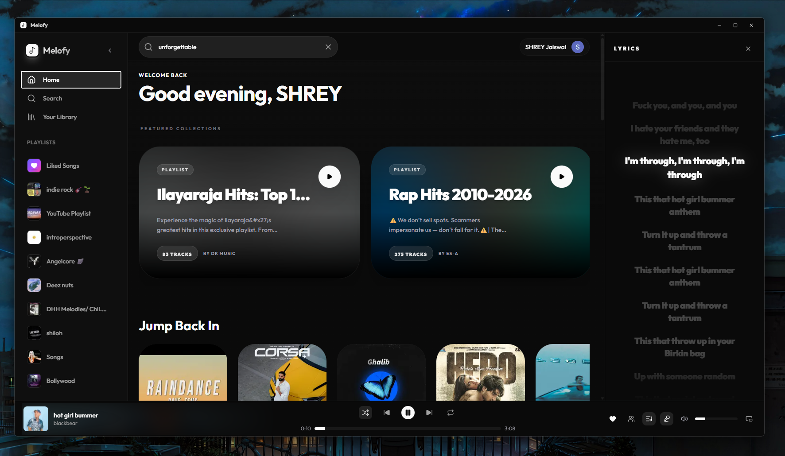
  
<i>Karaoke-style scroll-synced lyrics overlay utilizing real-time timestamp highlighting.</i>

---

### 📂 Collection & Organization
Curate your ultimate library and playlist ecosystem.

#### 🗂️ Music Library

  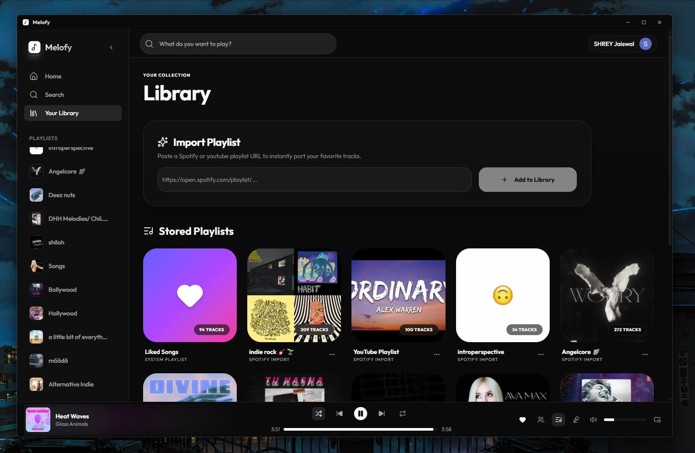
  
<i>Organize albums, artists, tracks, and local files in an intuitive, grid-based interface.</i>

#### 📝 Playlists & Mixes

  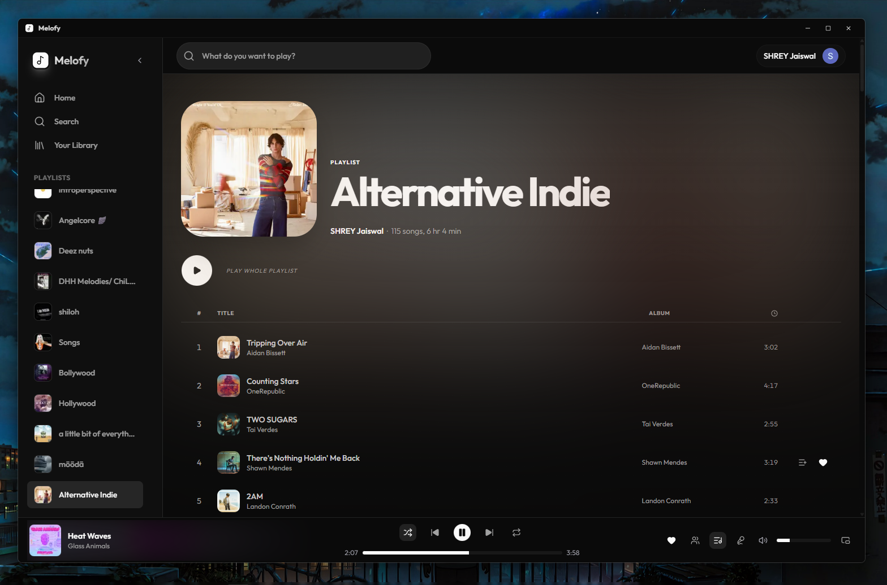
  
<i>Custom playlist creation, collaborative curator settings, and custom cover generation.</i>

#### 📑 Interactive Playback Queue (GIF)

  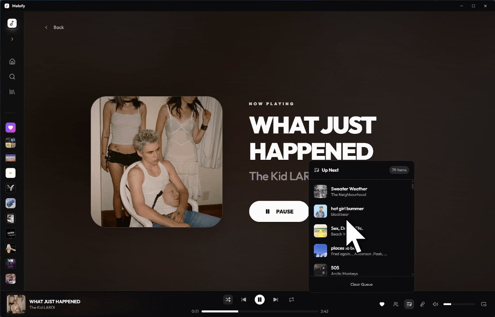
  
<i>Fluid drag-and-drop queue management for dynamic reordering.</i>

---

### 🔍 Discovery & Global Settings
Instantly find new sounds and customize your client parameters.

#### 🔎 Advanced Search Interface

  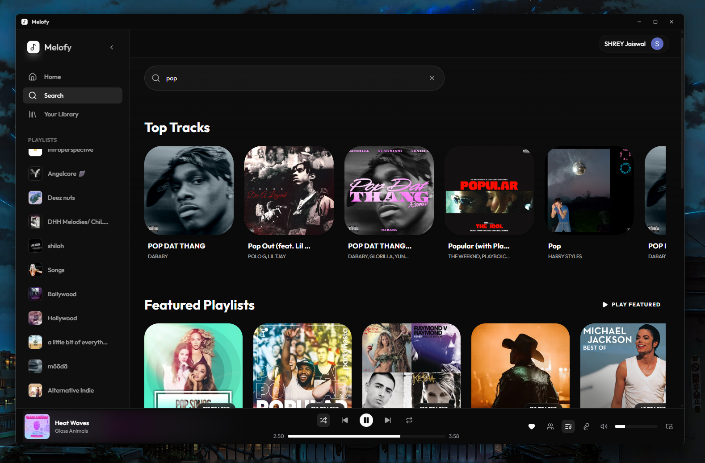
  
<i>Global fuzzy search supporting instant category filtering for Tracks, Artists, Playlists, and Albums.</i>

#### ⚡ Popover Quick Search

  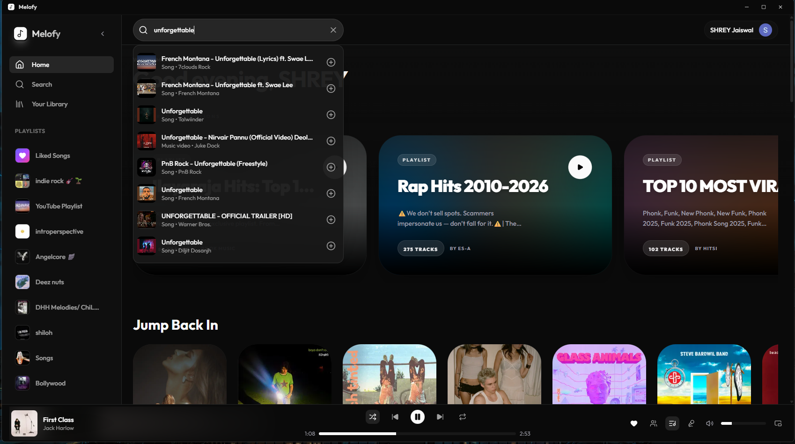
  
<i>Spotlight-style floating quick search accessible anywhere in the app via keyboard shortcuts.</i>

#### ⚙️ Application Preferences

  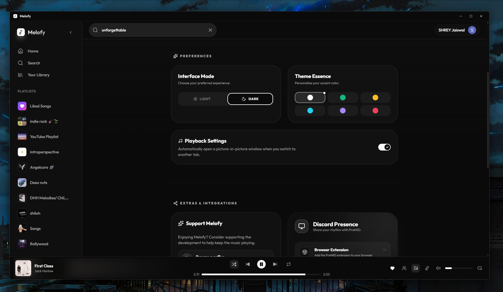
  
<i>Manage account options, customize client themes, configure hotkeys, and adjust streaming quality.</i>

---

### 🧩 Integrations & Widgets

#### 🖼️ Picture-in-Picture Mini-Player

  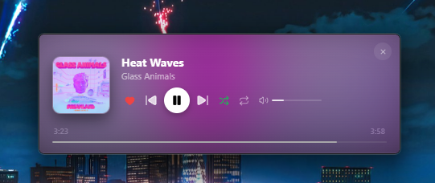
  
<i>Floating compact mini-player (PiP) to control music while focusing on other productive tasks.</i>

#### 👾 Discord Rich Presence

  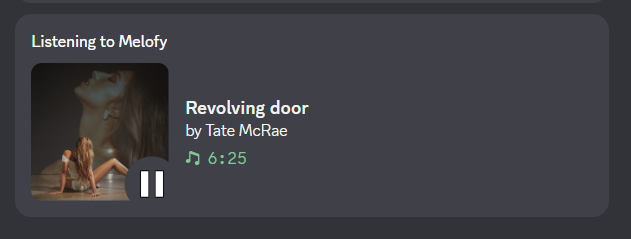
  
<i>Display your active Melofy playback status, cover art, track, and artist on your Discord Profile in real-time.</i>

---

## 📱 Mobile Native Experience

Optimized specifically for handheld devices using Capacitor 6. Enjoy full hardware accelerated transitions and touch gestures.

  <table border="0" cellspacing="0" cellpadding="10">
    <tr>
      <td align="center" valign="top">
        <h4>🏠 Home Screen</h4>
        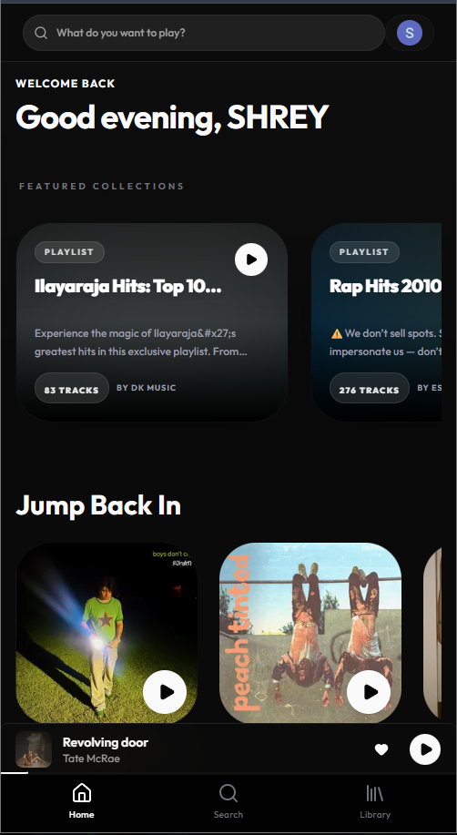
      </td>
      <td align="center" valign="top">
        <h4>🔍 Global Search</h4>
        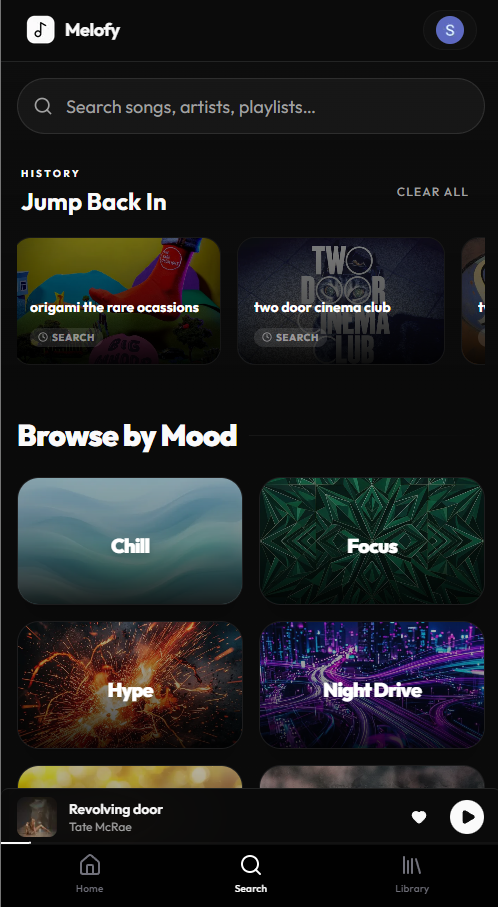
      </td>
      <td align="center" valign="top">
        <h4>🗂️ Library View</h4>
        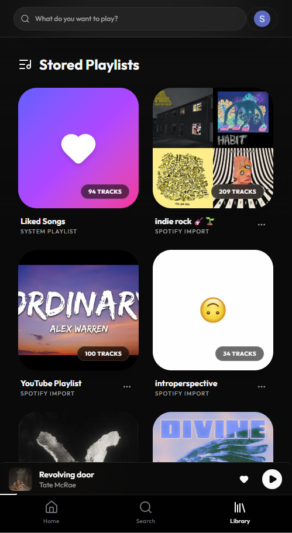
      </td>
    </tr>
    <tr>
      <td align="center" valign="top">
        <h4>💿 Now Playing</h4>
        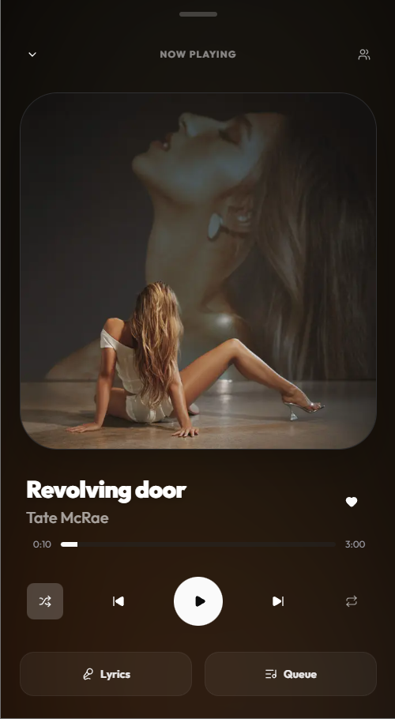
      </td>
      <td align="center" valign="top">
        <h4>🎤 Synced Lyrics</h4>
        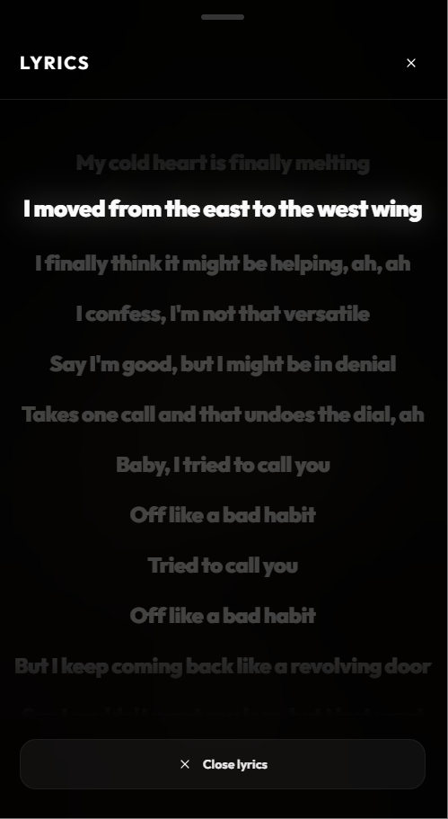
      </td>
      <td align="center" valign="top">
        <h4>📑 Playback Queue</h4>
        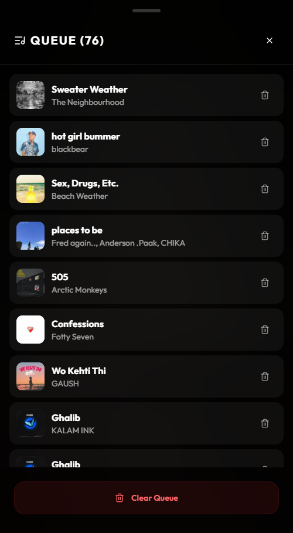
      </td>
    </tr>
  </table>

